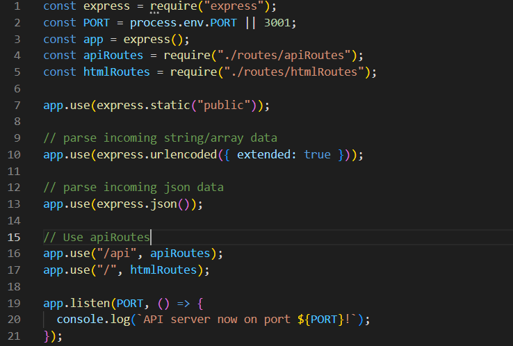
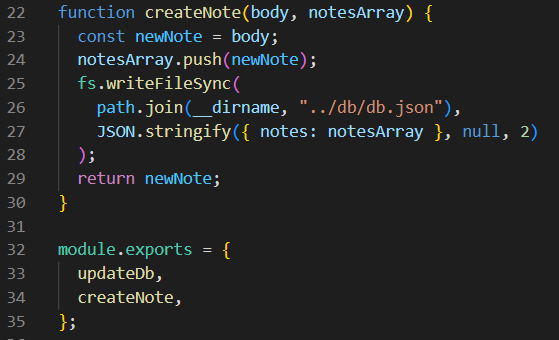
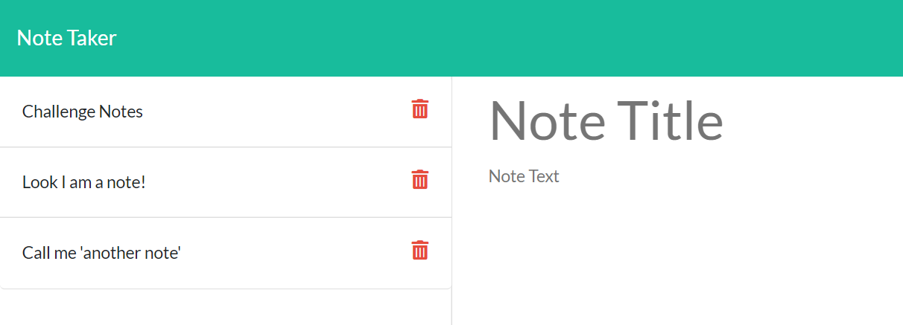
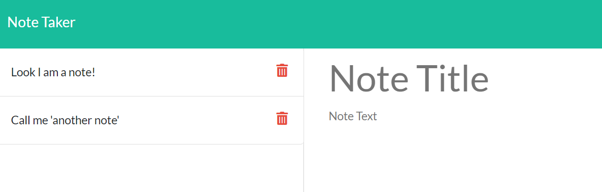
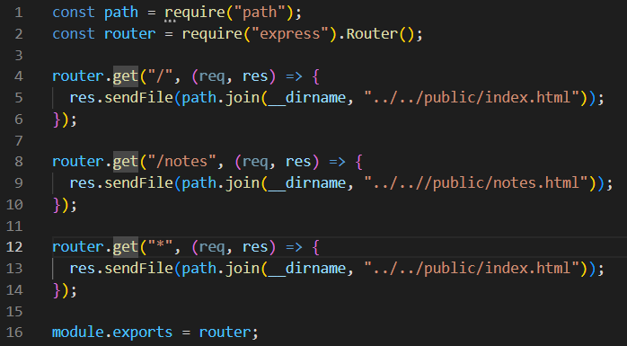

# Note-Breaker the Note Taker

## General Info
AS A small business owner
I WANT to be able to write and save notes
SO THAT I can organize my thoughts and keep track of tasks I need to complete

### Acceptance Criteria
GIVEN a note-taking application
WHEN I open the Note Taker
THEN I am presented with a landing page with a link to a notes page
WHEN I click on the link to the notes page
THEN I am presented with a page with existing notes listed in the left-hand column, plus empty fields to enter a new note title and the note’s text in the right-hand column
WHEN I enter a new note title and the note’s text
THEN a Save icon appears in the navigation at the top of the page
WHEN I click on the Save icon
THEN the new note I have entered is saved and appears in the left-hand column with the other existing notes
WHEN I click on an existing note in the list in the left-hand column
THEN that note appears in the right-hand column
WHEN I click on the Write icon in the navigation at the top of the page
THEN I am presented with empty fields to enter a new note title and the note’s text in the right-hand column

### Technologies
This project was completed using express.js and heroku.

## Creating and Editing Notes
To start the project I had to first set up my server.js file. I needed to add in all of the application and pathways the finished product would require as well as the server that would host my application.

Afterwards I set up my notes.js file to handle note creation and deletion. I would export createNote and updateDb functions and use them in my apiRoutes' index.js file. 

### Note Deletion
To delete notes I set up the function in notes.js and then called it in the index.js found in apiRoutes. When the note is deleted, the db file is refreshed and repopulated.  

Clicking the trash can icon deletes the note. Looking at the dev tools shows an error but on the user side there is no issue deleting different notes.

## Routing
I used the router object to set up the routing for my html files. Doing this would ensure that the user would see what they were intending to see whether it was the notes or the main start page. 

## Links
Heroku Active Link: https://infinite-springs-49706.herokuapp.com

Github Repository: https://github.com/hvphan1993/Note-Breaker.git